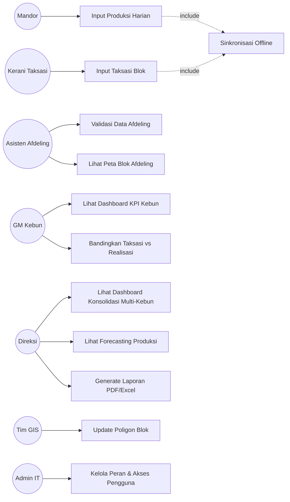
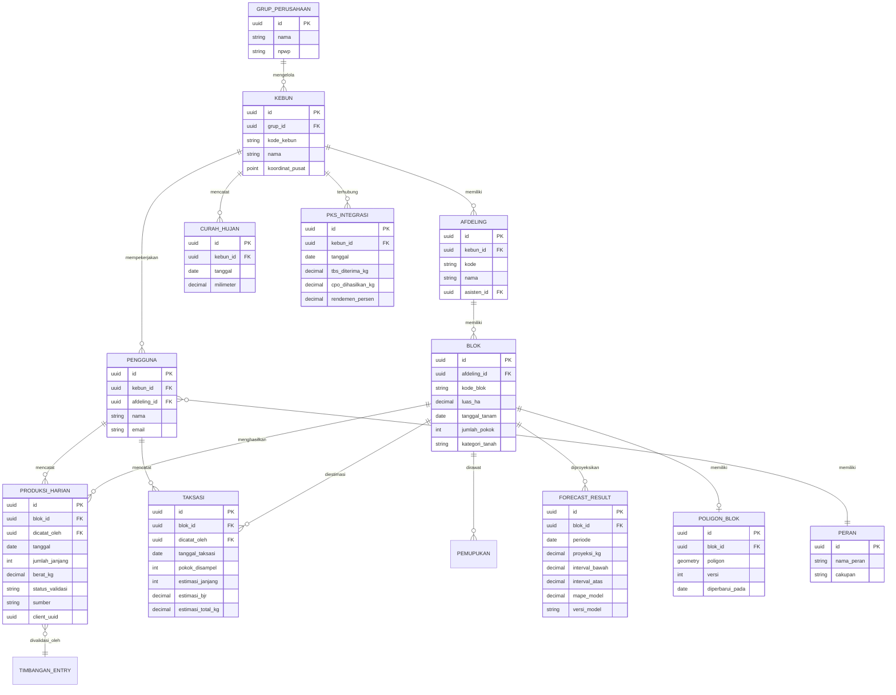
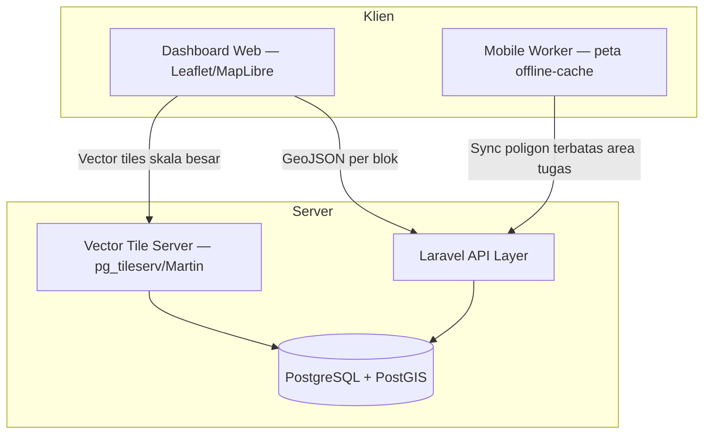
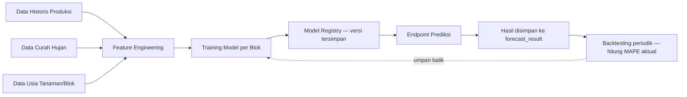
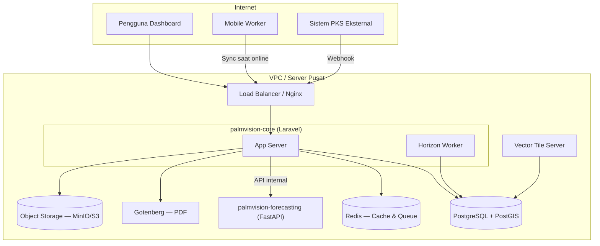
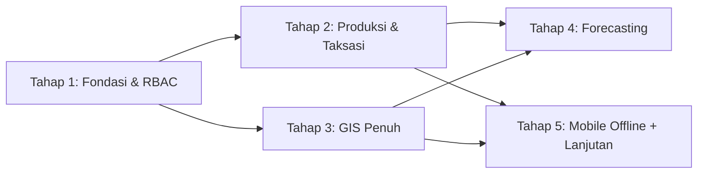

# PRD — PALMVISION

**Plantation Monitoring System untuk Perkebunan Kelapa Sawit**

| | |
|---|---|
| **Versi** | 1.0 |
| **Status** | Draft untuk validasi sebelum eksekusi |
| **Peran penyusun** | Enterprise Software Architect & System Analyst |
| **Pendekatan** | Software Engineering & System Design tingkat industri |
| **Batasan eksplisit** | Dokumen ini fokus pada analisis kebutuhan, desain arsitektur, dan roadmap — tidak berisi implementasi kode aplikasi |

---

## Catatan Asumsi yang Mengikat Seluruh Dokumen

Sebelum masuk ke 16 dokumen, satu keputusan arsitektural perlu dikunci karena berdampak ke hampir semua bagian berikut: **model kepemilikan sistem.**

> **Keputusan:** PALMVISION dirancang sebagai sistem **milik satu grup perusahaan perkebunan**, yang mengoperasikan **banyak kebun/estate**. Ini **bukan** SaaS multi-tenant untuk banyak perusahaan berbeda (berbeda dari pola SIMPUL yang melayani banyak sekolah independen).
>
> **Alasan:** Konteks "Enterprise Software Architect" dalam prompt asal mengindikasikan sistem ini dibangun *untuk* satu entitas bisnis perkebunan, bukan *dijual sebagai* platform ke banyak perusahaan berbeda. Hierarki data karenanya adalah **Grup Perusahaan → Kebun/Estate → Afdeling → Blok**, bukan `sekolah_id` seperti pola multi-tenant.
>
> Jika asumsi ini salah — misalnya kamu memang menargetkan PALMVISION sebagai produk SaaS untuk dijual ke banyak grup perusahaan sawit berbeda — beri tahu saya, karena ini mengubah skema data, RBAC, dan strategi deployment di seluruh dokumen ini secara signifikan.

Asumsi kedua yang lebih kecil: dokumen ini disusun dengan konteks eksekusi solo developer/tim kecil (konsisten dengan proyek sebelumnya), sehingga Roadmap Tahap 1–5 di bagian 14 memberi estimasi durasi yang realistis untuk skala tim tersebut, bukan tim enterprise besar. Bagian 16 (Penilaian Profesional) membahas implikasi asumsi ini secara eksplisit.

---

## Daftar Isi

1. [Latar Belakang](#1-latar-belakang)
2. [Studi Kasus Industri](#2-studi-kasus-industri)
3. [Rumusan Masalah](#3-rumusan-masalah)
4. [Stakeholder](#4-stakeholder)
5. [Use Case](#5-use-case)
6. [User Stories](#6-user-stories)
7. [ERD](#7-erd)
8. [Struktur Folder](#8-struktur-folder)
9. [API](#9-api)
10. [GIS Architecture](#10-gis-architecture)
11. [Forecasting Module](#11-forecasting-module)
12. [Deployment](#12-deployment)
13. [Security](#13-security)
14. [Roadmap Tahap 1–5](#14-roadmap-tahap-15)
15. [Verification Plan](#15-verification-plan)
16. [Penilaian Profesional](#16-penilaian-profesional)

---

## 1. Latar Belakang

### 1.1 Konteks Industri

Kelapa sawit adalah komoditas dengan siklus produksi yang panjang (tanaman produktif 25+ tahun) dan operasional yang sangat terdistribusi secara geografis. Satu grup perusahaan perkebunan tipikal mengelola beberapa kebun (estate), masing-masing terbagi menjadi beberapa afdeling, dan tiap afdeling terdiri dari puluhan blok tanam. Setiap level dalam hierarki ini menghasilkan data operasional harian — produksi, tenaga kerja, kondisi tanaman — yang secara tradisional masih dikelola secara manual atau semi-digital (Excel, WhatsApp, formulir kertas).

### 1.2 Kesenjangan Digital yang Umum Terjadi

Di banyak organisasi perkebunan, sistem informasi yang ada terfragmentasi: aplikasi keuangan/ERP terpisah dari sistem produksi kebun, data GIS dikelola tim survei sebagai file shapefile statis yang jarang diperbarui, dan data pabrik (PKS) tidak pernah terhubung balik ke data kebun. Akibatnya, manajemen di kantor pusat sering mengambil keputusan berdasarkan laporan yang sudah berumur berhari-hari, dan potensi korelasi antar-data (misalnya hubungan curah hujan dengan penurunan produksi tiga bulan kemudian) tidak pernah terlihat karena datanya tidak pernah disatukan.

### 1.3 Mengapa PALMVISION

PALMVISION dirancang bukan sebagai "ERP perkebunan generik", tetapi sebagai sistem yang berangkat dari tiga karakteristik unik domain sawit yang jarang ditangani serius oleh software administratif biasa:

1. **Data operasional punya dimensi spasial yang inheren** — setiap angka produksi melekat pada sebuah blok dengan poligon geografis nyata, bukan sekadar baris di tabel.
2. **Estimasi mendahului realisasi** — taksasi manual di lapangan sebelum panen adalah praktik industri yang mapan, dan sistem yang mengabaikan proses ini (dengan langsung lompat ke "forecasting berbasis AI") akan kehilangan sinyal yang sebenarnya paling akurat: mata kerani taksasi yang berjalan langsung ke blok.
3. **Konektivitas adalah kendala struktural, bukan insidental** — sebagian besar aktivitas pencatatan terjadi di lapangan, seringkali di area tanpa sinyal seluler yang layak.

### 1.4 Visi Produk

> Satu sistem yang menyatukan estimasi lapangan, realisasi produksi, data spasial kebun, dan prediksi berbasis data historis — sehingga manajemen dari level asisten afdeling sampai direksi melihat angka yang sama, diperbarui dari sumber yang sama, tanpa rekonsiliasi manual.

---

## 2. Studi Kasus Industri

> **Catatan metodologi:** Bagian ini menyajikan **pola umum industri** yang terdokumentasi secara luas dalam praktik manajemen perkebunan kelapa sawit (istilah taksasi, rendemen, BJR, afdeling adalah kosakata baku industri), bukan hasil studi primer atas perusahaan tertentu. Berbeda dari proyek SIMPUL yang mewajibkan wawancara lapangan sebagai bagian dari roadmap, dokumen ini belum divalidasi dengan wawancara langsung ke pengelola kebun. Bagian 16 membahas implikasi keterbatasan ini dan merekomendasikan validasi lapangan sebagai langkah verifikasi wajib sebelum Tahap 1 dimulai.

### 2.1 Pola Operasional yang Umum Ditemukan

| Area | Praktik umum saat ini | Konsekuensi operasional |
|---|---|---|
| **Taksasi produksi** | Kerani taksasi berjalan manual ke blok sebelum musim panen, menghitung estimasi janjang matang, dicatat di kertas/Excel | Estimasi sering meleset signifikan dari realisasi karena tidak ada riwayat akurasi taksasi yang dianalisis dari waktu ke waktu |
| **Produksi harian** | Dicatat manual oleh mandor per blok, direkap kerani afdeling, dikirim ke kantor kebun lewat WhatsApp atau kurir fisik | Keterlambatan visibilitas 1–3 hari; rawan salah rekap saat konsolidasi manual |
| **Rendemen (CPO/TBS)** | Dihitung di pabrik (PKS), sering merupakan entitas terpisah secara organisasi maupun sistem dari kebun | Kebun tidak punya umpan balik langsung soal efisiensi hasil panennya sendiri |
| **Data GIS blok** | Poligon dari survei awal (kadang bertahun-tahun lalu), disimpan sebagai file shapefile statis di komputer tim survei | Luas blok dan estimasi produksi per hektar bisa meleset karena data spasial usang |
| **Curah hujan & usia tanaman** | Dicatat terpisah (jika dicatat sama sekali), jarang dikorelasikan secara sistematis dengan tren produksi | Prediksi produksi hanya mengandalkan intuisi manajer berpengalaman, sulit diwariskan atau diaudit |
| **BJR (Berat Janjang Rata-rata)** | Dicatat manual per rotasi panen | Penurunan produktivitas blok sering baru disadari setelah berbulan-bulan, bukan terdeteksi dini |

### 2.2 Implikasi bagi Rancangan PALMVISION

Pola-pola di atas mengarahkan tiga keputusan desain yang mengikat dokumen ini:

1. Modul **Taksasi** harus berdiri terpisah dari **Forecasting** (bukan digabung), karena keduanya punya sumber data dan proses kerja yang fundamentally berbeda — satu manual visual di lapangan, satu model statistik dari data historis.
2. GIS bukan modul pelengkap, tetapi **fondasi struktural**: blok sebagai unit spasial adalah induk dari hampir seluruh data operasional lain (produksi, taksasi, pemupukan semua melekat pada blok).
3. Forecasting yang kredibel butuh integrasi curah hujan dan usia tanaman sebagai fitur model — bukan ekstrapolasi tren produksi historis semata.

---

## 3. Rumusan Masalah

| # | Rumusan Masalah | Modul yang menjawab |
|---|---|---|
| RM-1 | Bagaimana menyatukan pencatatan produksi harian dari seluruh afdeling ke satu sumber data real-time, menggantikan rekap manual via WhatsApp/Excel? | Produksi Harian, Mobile Worker |
| RM-2 | Bagaimana memastikan data poligon blok kebun tetap akurat dan dapat diperbarui tanpa bergantung pada file shapefile statis yang dikelola manual? | GIS, Blok Kebun |
| RM-3 | Bagaimana menghasilkan estimasi produksi yang mempertimbangkan taksasi lapangan, data historis, curah hujan, dan usia tanaman secara terintegrasi — bukan model tunggal yang menyederhanakan semuanya? | Taksasi, Forecasting, Curah Hujan |
| RM-4 | Bagaimana memungkinkan pencatatan data lapangan tetap berjalan di area dengan konektivitas buruk atau tanpa sinyal sama sekali? | Mobile Worker |
| RM-5 | Bagaimana memberi manajemen visibilitas KPI lintas kebun secara konsolidasi, tanpa kehilangan detail per-blok saat dibutuhkan? | Dashboard, GIS |
| RM-6 | Bagaimana memastikan akses data dibatasi sesuai hierarki organisasi (mandor hanya lihat bloknya, manajer kebun lihat seluruh kebunnya, direksi lihat semua) tanpa RBAC generik yang terlalu longgar atau terlalu kaku? | Manajemen Pengguna |
| RM-7 | Bagaimana menghasilkan laporan yang dapat langsung dipakai untuk keperluan internal dan audit (format PDF resmi, ekspor Excel) tanpa rekonstruksi manual dari data mentah? | Laporan |

---

## 4. Stakeholder

| Stakeholder | Peran dalam organisasi | Kebutuhan utama terhadap sistem | Frekuensi interaksi |
|---|---|---|---|
| **Direksi / Manajemen Pusat** | Pengambil keputusan strategis lintas kebun | Dashboard KPI konsolidasi, forecasting, laporan siap presentasi | Mingguan–bulanan |
| **General Manager Kebun / Estate Manager** | Penanggung jawab operasional satu kebun | Monitoring produksi per afdeling, perbandingan taksasi vs realisasi, peta kebun | Harian |
| **Asisten Afdeling** | Penanggung jawab operasional satu afdeling | Input & validasi data produksi dari mandor, status blok | Harian |
| **Mandor** | Pengawas langsung aktivitas panen di blok | Input produksi harian per blok, taksasi | Harian, di lapangan |
| **Kerani Taksasi** | Petugas estimasi produksi sebelum panen | Input taksasi per blok secara berkala | Mingguan, di lapangan |
| **Pemanen** | Pekerja lapangan pemanen TBS | (Tidak langsung — datanya direkam lewat mandor/timbangan) | Harian |
| **Tim GIS / Survey** | Pengelola data spasial kebun | Update poligon blok, validasi luas area | Insidental (saat ada perubahan lahan) |
| **Bagian Pabrik (PKS)** | Pengolah TBS menjadi CPO | Sumber data rendemen — kemungkinan sistem eksternal terintegrasi | Harian (via integrasi) |
| **Tim IT Perusahaan** | Pengelola infrastruktur & keamanan sistem | Kontrol akses, monitoring sistem, backup | Berkelanjutan |
| **Auditor Internal / QA** | Verifikasi kepatuhan data dan proses | Audit trail, laporan historis yang tidak dapat dimanipulasi | Berkala (audit) |

---

## 5. Use Case

### 5.1 Diagram Use Case (Gambaran Umum)



### 5.2 Daftar Use Case Utama

| Kode | Nama Use Case | Aktor Utama | Ringkasan |
|---|---|---|---|
| UC-01 | Input Produksi Harian | Mandor | Mencatat jumlah janjang dan berat TBS per blok per hari, termasuk offline |
| UC-02 | Input Taksasi Blok | Kerani Taksasi | Mencatat estimasi janjang matang sebelum rotasi panen berikutnya |
| UC-03 | Validasi Data Afdeling | Asisten Afdeling | Meninjau dan menyetujui data harian sebelum dikonsolidasi ke level kebun |
| UC-04 | Lihat Peta Interaktif Blok | Asisten, GM, Direksi | Menjelajah peta kebun, klik blok untuk detail produksi & status |
| UC-05 | Lihat Dashboard KPI | GM, Direksi | Melihat ringkasan realisasi vs taksasi vs forecasting dalam satu tampilan |
| UC-06 | Bandingkan Taksasi vs Realisasi | GM, Direksi | Analisis akurasi taksasi historis per blok/afdeling |
| UC-07 | Lihat Forecasting Produksi | Direksi, GM | Melihat proyeksi produksi n-periode ke depan dengan interval keyakinan |
| UC-08 | Generate Laporan | Semua peran manajerial | Menghasilkan laporan PDF/Excel terjadwal atau on-demand |
| UC-09 | Update Poligon Blok | Tim GIS | Memperbarui batas geografis blok, validasi luas area |
| UC-10 | Kelola Peran & Akses | Admin IT | Mengatur RBAC per hierarki organisasi |
| UC-11 | Sinkronisasi Data Offline | Mandor, Kerani | Antrean data lokal tersinkron otomatis saat koneksi kembali |
| UC-12 | Integrasi Data Timbangan/PKS | Sistem (otomatis) | Menarik data rendemen dan berat aktual dari sistem pabrik |
| UC-13 | Terima Notifikasi Ambang Batas | Asisten, GM | Peringatan otomatis saat realisasi jauh di bawah taksasi atau blok terlewat rotasi |

---

## 6. User Stories

Format: **US-xx**, dengan kriteria penerimaan (AC) yang bisa diuji. Berikut representasi dari tiap modul inti — bukan daftar lengkap seluruh 17 modul, karena sebagian akan lebih matang untuk didetailkan di Tahap 3–5 (lihat bagian 14).

### Modul Produksi Harian

**US-01 — Input Produksi Harian oleh Mandor**
*Sebagai mandor, saya ingin mencatat hasil panen blok saya setiap hari dengan cepat, walau tanpa sinyal.*

- AC1: Form input menampilkan hanya field esensial: blok, jumlah janjang, estimasi berat, catatan opsional.
- AC2: Data tersimpan lokal jika offline, tersinkron otomatis saat koneksi kembali.
- AC3: Satu blok hanya bisa punya satu entri produksi per hari per mandor (mencegah duplikasi input).
- AC4: Waktu yang dicatat adalah waktu perangkat dengan validasi kewajaran terhadap waktu server saat sinkron.

**US-02 — Validasi Data oleh Asisten Afdeling**
*Sebagai asisten afdeling, saya ingin meninjau data yang masuk dari mandor sebelum dikonsolidasi.*

- AC1: Data berstatus "menunggu validasi" tampil terpisah dari data yang sudah disetujui.
- AC2: Asisten dapat mengoreksi angka dengan jejak audit (nilai lama vs baru tercatat).
- AC3: Data yang tervalidasi tidak dapat diubah kembali oleh mandor, hanya oleh asisten dengan alasan tercatat.

### Modul Taksasi

**US-03 — Input Taksasi Blok**
*Sebagai kerani taksasi, saya ingin mencatat estimasi janjang matang per blok secara berkala.*

- AC1: Form mencatat: blok, tanggal taksasi, jumlah pokok disampel, estimasi janjang matang, estimasi BJR.
- AC2: Sistem menghitung estimasi total produksi otomatis dari input sampel.
- AC3: Taksasi tersimpan sebagai riwayat per blok — tidak menimpa taksasi periode sebelumnya.

**US-04 — Analisis Akurasi Taksasi**
*Sebagai GM kebun, saya ingin melihat seberapa akurat taksasi historis dibandingkan realisasi.*

- AC1: Sistem menghitung selisih persentase taksasi vs realisasi per blok, per afdeling, per periode.
- AC2: Blok dengan deviasi taksasi konsisten tinggi ditandai untuk ditinjau (potensi masalah kerani atau kondisi blok berubah).

### Modul GIS & Blok Kebun

**US-05 — Jelajah Peta Kebun**
*Sebagai GM kebun, saya ingin melihat peta kebun dengan blok berwarna sesuai status produktivitas.*

- AC1: Peta menampilkan poligon blok dengan warna sesuai ambang batas produktivitas (lihat token status di bagian design).
- AC2: Klik blok membuka panel detail: riwayat produksi, taksasi terakhir, usia tanaman, tanggal rotasi berikutnya.
- AC3: Peta dapat difilter per afdeling, per status, per rentang tanggal rotasi.

**US-06 — Perbarui Poligon Blok**
*Sebagai tim GIS, saya ingin memperbarui batas geografis blok saat ada perubahan lahan.*

- AC1: Import poligon dari file shapefile atau GeoJSON.
- AC2: Sistem menghitung ulang luas area otomatis dari poligon baru (fungsi spasial PostGIS).
- AC3: Perubahan poligon tercatat sebagai riwayat versi, bukan menimpa data lama tanpa jejak.

### Modul Forecasting

**US-07 — Lihat Proyeksi Produksi**
*Sebagai direksi, saya ingin melihat proyeksi produksi 3 bulan ke depan per kebun.*

- AC1: Grafik menampilkan realisasi historis, taksasi, dan forecasting dalam satu tampilan dengan interval keyakinan.
- AC2: Forecasting mempertimbangkan minimal: tren historis, curah hujan, usia tanaman per blok.
- AC3: Model menampilkan metrik akurasi (MAPE) dari periode sebelumnya, agar direksi tahu tingkat keandalan proyeksi.

### Modul Mobile Worker

**US-08 — Bekerja Sepenuhnya Offline**
*Sebagai mandor di area tanpa sinyal, saya ingin aplikasi tetap berfungsi penuh untuk input harian.*

- AC1: Seluruh alur input (produksi, taksasi) berfungsi tanpa koneksi internet.
- AC2: Status sinkronisasi (tersinkron/menunggu/gagal) selalu terlihat jelas.
- AC3: Data tidak pernah hilang meski aplikasi ditutup paksa saat masih offline.

### Modul Manajemen Pengguna

**US-09 — Akses Sesuai Hierarki Organisasi**
*Sebagai admin IT, saya ingin memastikan pengguna hanya melihat data sesuai cakupan tanggung jawabnya.*

- AC1: RBAC mengikuti hierarki: Grup → Kebun → Afdeling → Blok, dengan scoping otomatis per peran.
- AC2: Direksi dapat melihat lintas kebun; GM hanya kebunnya; asisten hanya afdelingnya; mandor hanya blok yang ditugaskan.
- AC3: Ada tes eksplisit yang membuktikan asisten afdeling A tidak bisa mengakses data afdeling B di kebun yang sama.

### Modul Laporan

**US-10 — Ekspor Laporan Terformat**
*Sebagai GM kebun, saya ingin mengekspor laporan bulanan dalam format yang siap dikirim ke kantor pusat.*

- AC1: PDF menyertakan kop kebun, periode laporan, dan blok tanda tangan.
- AC2: Ekspor Excel mempertahankan struktur tabel yang bisa langsung diproses ulang (bukan gambar tabel).
- AC3: Laporan dapat dijadwalkan otomatis (misalnya terkirim ke email GM setiap tanggal 1).

---

## 7. ERD

### 7.1 Diagram Relasi Inti



### 7.2 Aturan Data Kunci

| # | Aturan | Alasan |
|---|---|---|
| D1 | Setiap tabel transaksional (`produksi_harian`, `taksasi`, dll.) memiliki `blok_id` sebagai induk langsung | Blok adalah unit spasial-operasional terkecil; semua analitik dibangun dari level ini ke atas |
| D2 | `poligon_blok` disimpan dengan versi, bukan menimpa data lama | Perubahan batas lahan perlu dapat ditelusuri riwayatnya, terutama untuk keperluan audit legal/agraria |
| D3 | `produksi_harian` menyimpan `client_uuid` unik dari perangkat mobile | Prasyarat idempotency untuk sinkronisasi offline (lihat bagian 10 dan pola serupa yang telah terbukti pada proyek SIMPUL) |
| D4 | Kolom spasial (`poligon`, `koordinat_pusat`) bertipe `geometry`/`geography` PostGIS, bukan pasangan lat/lng terpisah | Memungkinkan query spasial native (luas, overlap, radius) di level database |
| D5 | `forecast_result` menyimpan `versi_model` dan `mape_model` per baris | Setiap proyeksi harus bisa ditelusuri model mana yang menghasilkannya — prasyarat audit model machine learning |
| D6 | Tidak ada hard delete pada `blok`, `produksi_harian`, `taksasi` | Data historis produksi adalah aset jangka panjang untuk forecasting; soft delete + status arsip |

---

## 8. Struktur Folder

Mengikuti keputusan arsitektur **Modular Monolith (Laravel) + Layanan Forecasting terpisah (Python/FastAPI)** dari hasil brainstorming — dua repositori terpisah, dihubungkan lewat API internal.

### 8.1 Repositori Utama — `palmvision-core` (Laravel)

```
palmvision-core/
├── app/
│   ├── Domain/                        # Domain-Driven, dipisah per modul bisnis
│   │   ├── Produksi/
│   │   │   ├── Actions/CatatProduksiHarian.php
│   │   │   ├── Models/ProduksiHarian.php
│   │   │   └── Services/ValidasiProduksiService.php
│   │   ├── Taksasi/
│   │   │   ├── Actions/CatatTaksasi.php
│   │   │   ├── Models/Taksasi.php
│   │   │   └── Services/AkurasiTaksasiCalculator.php
│   │   ├── Gis/
│   │   │   ├── Models/PoligonBlok.php
│   │   │   ├── Services/SpatialQueryService.php
│   │   │   └── Services/PoligonImportService.php
│   │   ├── Forecasting/
│   │   │   ├── Services/ForecastingClient.php   # HTTP client ke service Python
│   │   │   └── Models/ForecastResult.php
│   │   ├── Kepegawaian/
│   │   ├── Pemupukan/
│   │   └── Integrasi/
│   │       ├── Timbangan/
│   │       └── Pks/
│   ├── Http/
│   │   ├── Controllers/Api/            # Untuk mobile worker & klien eksternal
│   │   ├── Controllers/Web/            # Untuk dashboard Inertia
│   │   ├── Requests/
│   │   └── Middleware/SetKebunAktif.php
│   ├── Models/Concerns/BelongsToKebun.php
│   ├── Policies/
│   └── Jobs/
├── database/
│   ├── migrations/
│   └── seeders/
├── resources/js/
│   ├── Layouts/AppLayout.vue
│   ├── Pages/{Dashboard,Produksi,Taksasi,Gis,Laporan,Pengguna}/
│   ├── Components/
│   │   ├── Map/                        # Komponen peta Leaflet/MapLibre
│   │   │   ├── BlokPolygonLayer.vue
│   │   │   └── BlokDetailPanel.vue
│   │   ├── DataTable/
│   │   └── Charts/ForecastChart.vue
│   └── composables/useMapLayer.ts
├── routes/
│   ├── web.php
│   └── api.php                         # Dikonsumsi Mobile Worker
├── docs/
│   ├── adr/
│   └── PRD.md
└── docker-compose.yml
```

### 8.2 Repositori Layanan — `palmvision-forecasting` (Python/FastAPI)

```
palmvision-forecasting/
├── app/
│   ├── main.py                         # Entry point FastAPI
│   ├── api/
│   │   └── v1/routes_forecast.py
│   ├── models/
│   │   ├── time_series_model.py        # Wrapper Prophet/SARIMA
│   │   └── feature_engineering.py      # Curah hujan, usia tanaman, dsb
│   ├── pipeline/
│   │   ├── data_loader.py              # Tarik data historis dari palmvision-core via API/DB
│   │   ├── train.py
│   │   └── evaluate.py                 # Hitung MAPE, RMSE
│   ├── schemas/
│   │   └── forecast_request.py
│   └── storage/
│       └── model_registry/             # Versi model tersimpan (joblib/pickle)
├── notebooks/                          # Eksplorasi & validasi model (tidak untuk produksi)
├── tests/
└── requirements.txt
```

### 8.3 Repositori Mobile Worker — `palmvision-mobile` (PWA atau Flutter, terpisah)

```
palmvision-mobile/
├── src/
│   ├── offline/
│   │   ├── db.ts                       # Skema IndexedDB (Dexie) — pola sama dengan SIMPUL
│   │   └── syncQueue.ts
│   ├── screens/
│   │   ├── ProduksiHarianScreen
│   │   └── TaksasiScreen
│   └── api/client.ts                   # Konsumsi Sanctum token dari palmvision-core
```

> **Catatan:** struktur di atas adalah **desain**, bukan kode yang siap dijalankan — sesuai batasan eksplisit di prompt asal untuk tidak langsung menghasilkan implementasi.

---

## 9. API

### 9.1 Prinsip Desain API

| Prinsip | Penjelasan |
|---|---|
| Dua jalur autentikasi berbeda secara sengaja | Dashboard web (Inertia) memakai sesi (Fortify); Mobile Worker dan integrasi eksternal memakai token (Laravel Sanctum) — karena keduanya punya model ancaman dan siklus hidup klien yang berbeda |
| Versioning eksplisit | Semua endpoint API di bawah `/api/v1/`, agar perubahan besar di kemudian hari tidak memutus klien mobile yang sudah terpasang di lapangan |
| Idempotency wajib pada endpoint tulis dari mobile | Sinkronisasi offline berarti request bisa terkirim ulang; server harus aman menerima duplikasi |
| Respons selalu menyertakan metadata sinkronisasi | Setiap create/update endpoint mengembalikan `server_timestamp`, agar klien bisa mendeteksi clock drift |

### 9.2 Endpoint Inti (Ringkasan Kontrak)

| Method | Endpoint | Deskripsi | Auth |
|---|---|---|---|
| `POST` | `/api/v1/auth/login` | Login mobile worker, mengembalikan token Sanctum | Publik |
| `POST` | `/api/v1/produksi/sync` | Kirim antrean produksi harian (array), idempotent via `client_uuid` | Sanctum |
| `GET` | `/api/v1/produksi?blok_id=&periode=` | Ambil data produksi untuk sinkronisasi turun (offline cache) | Sanctum |
| `POST` | `/api/v1/taksasi/sync` | Kirim antrean taksasi | Sanctum |
| `GET` | `/api/v1/gis/blok/{id}/poligon` | Ambil GeoJSON poligon satu blok | Sanctum |
| `GET` | `/api/v1/gis/afdeling/{id}/blok` | Ambil seluruh poligon blok dalam satu afdeling (untuk render peta) | Sanctum |
| `POST` | `/api/v1/gis/blok/{id}/poligon` | Perbarui poligon blok (tim GIS), membuat versi baru | Sanctum + Policy |
| `GET` | `/api/v1/dashboard/kpi?kebun_id=&periode=` | Ringkasan KPI untuk dashboard | Sesi/Sanctum |
| `POST` | `/api/v1/forecast/generate` | Trigger job forecasting untuk satu kebun/periode (proxy ke layanan Python) | Sesi (internal) |
| `GET` | `/api/v1/forecast/{blok_id}` | Ambil hasil forecast tersimpan | Sesi/Sanctum |
| `POST` | `/api/v1/laporan/export` | Trigger generate laporan PDF/Excel (queue job) | Sesi |
| `POST` | `/webhooks/pks/rendemen` | Endpoint masuk dari sistem PKS eksternal (jika integrasi push-based) | API Key khusus partner |

### 9.3 Kontrak Internal ke Layanan Forecasting

```
POST http://forecasting-service:8000/api/v1/forecast

Request:
{
  "blok_id": "uuid",
  "horizon_bulan": 3,
  "fitur_tambahan": {
    "curah_hujan_historis": [...],
    "usia_tanaman_bulan": 84
  }
}

Response:
{
  "blok_id": "uuid",
  "proyeksi": [
    { "periode": "2026-11", "nilai_kg": 18420, "interval_bawah": 16100, "interval_atas": 20700 }
  ],
  "mape_model": 0.087,
  "versi_model": "prophet-v3-2026Q3"
}
```

Komunikasi antar-layanan ini bersifat **internal-only** (tidak diekspos ke publik), diamankan lewat jaringan internal Docker/VPC dan API key layanan-ke-layanan, bukan token pengguna.

---

## 10. GIS Architecture

### 10.1 Keputusan Inti

GIS **tidak** dibangun sebagai layanan terpisah — poligon dan query spasial hidup langsung di PostgreSQL dengan ekstensi **PostGIS**, karena query seperti "hitung luas blok dari poligon", "cek apakah dua poligon overlap", atau "cari semua blok dalam radius X km" jauh lebih efisien dieksekusi sebagai satu query database dibanding ditarik ke aplikasi lalu dihitung manual.

### 10.2 Diagram Arsitektur GIS



### 10.3 Strategi Penyajian Peta

| Skenario | Strategi |
|---|---|
| Menampilkan seluruh blok satu afdeling (puluhan poligon) | GeoJSON langsung dari API — volume kecil, tidak perlu tiling |
| Menampilkan seluruh kebun/grup (ratusan–ribuan poligon) | Vector tile server (`pg_tileserv` atau `Martin`) di depan PostGIS, agar peta tidak me-load seluruh poligon sekaligus |
| Mobile worker offline | Poligon blok yang menjadi tanggung jawab mandor/kerani tersebut di-cache lokal saat online, dipakai ulang saat offline — bukan seluruh kebun, agar ukuran cache tetap wajar |
| Citra satelit/drone (fase lanjutan) | Disimpan sebagai raster tile terpisah (bukan di database transaksional) — lihat catatan risiko di bagian 16 |

### 10.4 Contoh Query Spasial Kunci (ilustrasi desain, bukan implementasi penuh)

```sql
-- Hitung ulang luas blok dari poligon (dalam hektar)
SELECT id, ST_Area(poligon::geography) / 10000 AS luas_ha
FROM poligon_blok
WHERE blok_id = :blok_id;

-- Deteksi tumpang tindih poligon antar blok (validasi data GIS)
SELECT a.blok_id, b.blok_id
FROM poligon_blok a
JOIN poligon_blok b ON a.id < b.id
WHERE ST_Overlaps(a.poligon, b.poligon);
```

Dua query ini menjadi dasar dua fitur penting: perhitungan luas otomatis (US-06) dan validasi kualitas data GIS saat impor poligon baru.

---

## 11. Forecasting Module

### 11.1 Perbedaan Tegas dengan Taksasi

| | Taksasi | Forecasting |
|---|---|---|
| Sumber data | Observasi manual langsung di blok | Model statistik dari data historis |
| Horizon | Jangka pendek (1 rotasi panen ke depan) | Jangka menengah (1–6 bulan) |
| Siapa yang menghasilkan | Kerani taksasi (manusia) | Sistem (model machine learning/statistik) |
| Modul terkait | Bagian 5–6 (Use Case, User Stories) | Bagian ini |

Keduanya **saling melengkapi**, bukan saling menggantikan — taksasi menjadi salah satu input pembanding untuk mengevaluasi akurasi forecasting dari waktu ke waktu (US-04 secara tidak langsung juga memvalidasi model forecasting).

### 11.2 Pendekatan Model

| Komponen | Pilihan | Alasan |
|---|---|---|
| Model dasar | Prophet (Meta) atau SARIMA | Time-series dengan musiman kuat (siklus panen, musim hujan) — Prophet menangani musiman dan hari libur/anomali dengan baik tanpa tuning berat |
| Fitur tambahan (regressor eksternal) | Curah hujan historis, usia tanaman, kategori tanah | Faktor-faktor ini punya pengaruh agronomis nyata terhadap produksi sawit, bukan sekadar tren waktu |
| Granularitas | Per blok, diagregasi ke afdeling/kebun untuk tampilan dashboard | Prediksi di level blok memungkinkan deteksi anomali lebih presisi dibanding model tunggal per kebun |
| Evaluasi | MAPE (Mean Absolute Percentage Error) dan backtesting berkala | MAPE mudah diinterpretasi non-teknis ("proyeksi ini meleset rata-rata 8.7%") — penting untuk kredibilitas di hadapan direksi |

### 11.3 Pipeline Forecasting



### 11.4 Strategi Retraining

Model dilatih ulang secara berkala (disarankan bulanan, mengikuti siklus rekap produksi), bukan real-time — karena data produksi bersifat harian/mingguan agregat, retraining terlalu sering tidak memberi manfaat tambahan namun menambah kompleksitas operasional. Setiap retraining menghasilkan `versi_model` baru, dan hasil prediksi lama tetap tersimpan untuk keperluan audit (lihat aturan D5 di bagian 7.2).

### 11.5 Batasan yang Harus Dikomunikasikan ke Pengguna

Forecasting **tidak** dirancang untuk menggantikan taksasi manual, dan akurasinya secara struktural bergantung pada kualitas dan panjang data historis yang tersedia — pada tahun-tahun awal implementasi sistem, akurasi model kemungkinan rendah karena data historis digital belum cukup panjang. Ini bukan kegagalan desain, melainkan realitas domain time-series yang harus dikomunikasikan secara eksplisit ke direksi sejak awal (dibahas lebih lanjut di bagian 16).

---

## 12. Deployment

### 12.1 Topologi Infrastruktur



### 12.2 Lingkungan

| Lingkungan | Tujuan | Catatan |
|---|---|---|
| Local (Docker Compose) | Pengembangan sehari-hari | Seluruh layanan (app, db, forecasting, tile server) jalan di satu mesin dev |
| Staging | UAT bersama stakeholder kebun sebelum rilis | Data mirip produksi tapi anonim/sampel |
| Production | Operasional nyata | Backup harian wajib, monitoring aktif |

### 12.3 Strategi Skalabilitas

| Komponen | Strategi skala |
|---|---|
| App server Laravel | Horizontal scaling di belakang load balancer bila jumlah kebun bertambah signifikan |
| Queue worker (Horizon) | Tambah worker terpisah untuk job berat (generate laporan besar, sinkronisasi batch) agar tidak memblokir job ringan |
| PostGIS | Indeks spasial (GiST) wajib pada kolom `geometry`; pertimbangkan read replica jika query dashboard mulai membebani database utama |
| Layanan Forecasting | Diskalakan independen dari app utama — training model bisa jadi proses CPU-intensif berkala, tidak perlu mempengaruhi kapasitas app server |
| Tile server | Cache tile agresif (tidak berubah sesering data transaksional) |

### 12.4 CI/CD

Pola serupa proyek sebelumnya: `push` → lint (Pint/ESLint) → static analysis (Larastan) → test (Pest, dengan service PostgreSQL+PostGIS di CI) → build asset → *(branch utama)* deploy otomatis. Layanan forecasting Python punya pipeline CI terpisah (lint, test model dengan data sampel, tidak melatih ulang model penuh di CI).

### 12.5 Backup & Disaster Recovery

- Dump PostgreSQL harian terenkripsi, termasuk data spasial (PostGIS dump kompatibel dengan `pg_dump` standar).
- Model forecasting tersimpan dengan versi di object storage — restorasi tidak bergantung pada pelatihan ulang darurat.
- RPO (Recovery Point Objective) disarankan 24 jam, RTO (Recovery Time Objective) 4 jam — sejalan dengan pola NFR proyek sebelumnya, disesuaikan lebih ketat jika sistem sudah menjadi operasional kritis harian.

---

## 13. Security

### 13.1 Model Otentikasi Ganda

| Jalur | Mekanisme | Alasan |
|---|---|---|
| Dashboard web (manajemen) | Sesi (Laravel Fortify) | First-party, satu domain, tidak butuh kompleksitas token |
| Mobile Worker & integrasi eksternal | Token (Laravel Sanctum), dengan kemampuan revoke per-device | Perangkat lapangan bisa hilang/dicuri; token harus bisa dicabut tanpa mengganggu pengguna lain |

### 13.2 RBAC Berlapis Hierarki

Bukan RBAC generik "admin/user", melainkan mengikuti struktur organisasi langsung:

```
Direksi           → akses lintas seluruh Grup Perusahaan
GM Kebun          → akses satu Kebun (semua afdeling di dalamnya)
Asisten Afdeling  → akses satu Afdeling (semua blok di dalamnya)
Mandor/Kerani     → akses blok yang ditugaskan secara eksplisit
Admin IT          → akses pengelolaan pengguna & sistem, tanpa otomatis punya akses ke data operasional
```

Scoping ditegakkan di **Policy**, bukan hanya query controller — pola yang sama dengan pendekatan tenant isolation di SIMPUL, di sini diterapkan sebagai *organization-tree scoping* dan bukan *tenant isolation* datar.

### 13.3 Keamanan Data Spasial

Poligon blok dan koordinat kebun adalah data yang secara bisnis sensitif (nilai aset lahan, batas legal). Akses baca poligon detail dibatasi peran tertentu; akses publik (jika ada portal eksternal di masa depan) hanya menampilkan versi tersederhanakan (generalized geometry), bukan poligon presisi tinggi.

### 13.4 Keamanan Integrasi Eksternal (PKS/Timbangan)

- Endpoint webhook masuk (`/webhooks/pks/rendemen`) diverifikasi dengan API key + signature (HMAC), bukan hanya IP whitelist yang mudah dipalsukan.
- Setiap payload masuk dari sistem eksternal divalidasi skema ketat sebelum disimpan — data pihak ketiga tidak pernah dipercaya secara implisit.

### 13.5 Audit & Kepatuhan

- Seluruh perubahan pada `produksi_harian`, `taksasi`, dan `poligon_blok` tercatat di audit log (aktor, nilai lama/baru, waktu).
- Data kepegawaian (mandor, kerani, dsb.) mengikuti prinsip minimum data yang diperlukan — bukan menyimpan data pribadi pekerja secara berlebihan tanpa dasar pemrosesan yang jelas, mengacu prinsip UU PDP.

### 13.6 Checklist Keamanan Standar Industri

- Validasi input di Form Request/Pydantic schema pada kedua repositori (Laravel & FastAPI).
- Rate limiting pada endpoint autentikasi dan sinkronisasi mobile.
- Dependency scanning berkala (Laravel: `composer audit`; Python: `pip-audit`).
- Pengujian OWASP Top 10 dasar sebelum rilis produksi (lihat bagian 15).

---

## 14. Roadmap Tahap 1–5

> Estimasi durasi mengasumsikan tim kecil/solo developer (konsisten dengan konteks proyek sebelumnya). Untuk tim enterprise penuh, durasi tiap tahap secara realistis dapat dipersingkat dengan paralelisasi kerja antar anggota tim.

| Tahap | Fokus | Estimasi Durasi | Exit Criteria |
|---|---|---|---|
| **Tahap 1** | Fondasi: struktur organisasi (Grup→Kebun→Afdeling→Blok), Auth & RBAC hierarkis, Dashboard dasar, setup PostGIS | 4–5 minggu | Login berjenjang berfungsi; scoping data teruji lintas level organisasi; peta dasar menampilkan blok dari data seed |
| **Tahap 2** | Produksi Harian, Taksasi, Validasi berjenjang, Laporan PDF/Excel dasar | 4–5 minggu | Mandor dapat input produksi; asisten dapat memvalidasi; laporan bulanan dapat diekspor |
| **Tahap 3** | GIS penuh: import/update poligon, panel detail blok, vector tile untuk skala besar | 3–4 minggu | Update poligon blok menghitung ulang luas otomatis; peta kebun penuh (bukan hanya afdeling) tampil responsif |
| **Tahap 4** | Curah Hujan, Layanan Forecasting (Python), integrasi ke dashboard, evaluasi MAPE | 4–5 minggu | Proyeksi produksi tampil dengan interval keyakinan; backtesting model terhadap data historis terdokumentasi |
| **Tahap 5** | Mobile Worker offline-first penuh, modul lanjutan (Pemupukan, Tenaga Kerja, integrasi Timbangan/PKS), notifikasi ambang batas | 5–6 minggu | Input lapangan berfungsi tanpa sinyal dan tersinkron idempoten; integrasi eksternal PKS berjalan dengan data sampel |

**Total estimasi:** ±20–25 minggu untuk cakupan penuh 10 modul inti + 7 modul tambahan. Ini signifikan lebih panjang dari proyek SIMPUL (14 minggu) karena kompleksitas tambahan dari GIS spasial dan layanan forecasting terpisah — bagian 16 membahas apakah cakupan ini realistis untuk dikerjakan solo atau perlu dipangkas lebih lanjut.

### Urutan Ketergantungan Kritis



Forecasting (Tahap 4) tidak bisa dimulai serius sebelum Tahap 2 menghasilkan beberapa periode data produksi nyata — model time-series butuh data historis untuk dilatih, sehingga urutan ini bukan preferensi melainkan keharusan teknis.

---

## 15. Verification Plan

| Area Verifikasi | Metode | Kapan |
|---|---|---|
| **Korektnes RBAC hierarkis** | Tes otomatis eksplisit: setiap level (mandor/asisten/GM/direksi) mencoba akses data di luar cakupannya → harus ditolak | Setiap Tahap, wajib sebelum lanjut ke tahap berikut |
| **Akurasi perhitungan luas GIS** | Bandingkan hasil `ST_Area()` dengan luas yang diketahui manual untuk minimal 5 blok sampel | Tahap 3 |
| **Ketahanan sinkronisasi offline** | Uji manual: input di mode pesawat, tutup aplikasi paksa, nyalakan jaringan, verifikasi tidak ada duplikasi maupun data hilang | Tahap 5 |
| **Kualitas data historis sebelum training model** | Audit kelengkapan dan konsistensi data produksi sebelum dipakai melatih model forecasting (celah data, perubahan format, outlier tidak wajar) | Awal Tahap 4, sebelum training pertama |
| **Akurasi model forecasting** | Backtesting: latih model dengan data sampai periode N, uji prediksi terhadap data aktual periode N+1 yang sudah diketahui; laporkan MAPE | Tahap 4, berulang tiap retraining |
| **Keamanan endpoint publik/webhook** | Pengujian dasar OWASP Top 10 (injection, broken auth, sensitive data exposure) sebelum go-live | Sebelum rilis produksi |
| **Performa peta dengan volume poligon besar** | Uji render peta dengan skenario 1 kebun penuh (ratusan blok) — ukur waktu render dan penggunaan memori klien | Tahap 3 |
| **UAT bersama pengguna nyata** | Sesi uji dengan minimal satu asisten afdeling dan satu mandor menggunakan alur input harian di kondisi lapangan sesungguhnya | Akhir Tahap 2 dan akhir Tahap 5 |
| **Validasi integrasi PKS/Timbangan** | Uji dengan data sampel/mock dari format sistem pihak ketiga sebelum integrasi langsung ke sistem produksi mereka | Tahap 5 |

---

## 16. Penilaian Profesional

Bagian ini adalah penilaian jujur terhadap dokumen ini sendiri — bagian yang paling sering dihilangkan dari dokumen perencanaan, padahal paling menentukan apakah proyek ini realistis dieksekusi.

### 16.1 Kekuatan Rancangan Ini

- Pemisahan tegas antara **Taksasi** (manual) dan **Forecasting** (model) adalah keputusan yang secara spesifik lahir dari pemahaman domain, bukan template generik — ini akan terlihat jelas oleh siapa pun yang memahami industri perkebunan.
- Keputusan menempatkan GIS langsung di PostgreSQL/PostGIS (bukan layanan terpisah) adalah pilihan yang dapat dipertahankan secara teknis: query spasial di level aplikasi hampir selalu lebih lambat dan lebih rawan bug dibanding memanfaatkan mesin database yang memang dirancang untuk itu.
- Arsitektur layanan forecasting terpisah menghindari jebakan umum: memaksa seluruh aplikasi memakai Python demi satu modul, atau sebaliknya memaksa time-series modeling yang serius dikerjakan di PHP tanpa ekosistem yang memadai.

### 16.2 Titik Lemah yang Harus Diakui

- **Bagian 2 (Studi Kasus Industri) belum divalidasi dengan riset primer.** Ini eksplisit disebutkan di bagian itu sendiri, tapi layak ditegaskan ulang di sini: sebelum Tahap 1 dimulai, sangat disarankan melakukan minimal 1–2 wawancara dengan pihak yang memahami operasional kebun nyata (pola yang sama seperti riset lapangan di SIMPUL). Tanpa ini, ada risiko istilah dan alur kerja yang digambarkan di dokumen ini terdengar benar secara teori tapi meleset pada detail operasional nyata.
- **Skala 17 modul (10 asal + 7 tambahan) untuk solo developer adalah cakupan yang besar.** Estimasi 20–25 minggu di bagian 14 sudah jujur mengakui ini lebih panjang dari SIMPUL. Rekomendasi konkret: jika proyek ini juga ditujukan sebagai portofolio dengan batas waktu, pertimbangkan memangkas ke pola yang sama seperti SIMPUL — pilih 3–4 modul untuk dikerjakan **dalam**, jadikan sisanya dirancang di level dokumen/skema tapi tidak diimplementasikan penuh. Kandidat kuat untuk "dikerjakan dalam": **GIS + Blok Kebun**, **Produksi Harian + Taksasi**, dan **Forecasting**, karena tiga area ini yang paling menunjukkan kedalaman teknis (spatial query, offline sync, time-series modeling dengan regressor eksternal).
- **Akurasi forecasting bergantung pada data yang belum tentu tersedia panjang.** Ini sudah disebut di 11.5, tapi implikasinya nyata: pada demo awal, model kemungkinan tidak bisa menunjukkan akurasi tinggi karena data historis digital belum cukup panjang. Solusi realistis untuk konteks portofolio: gunakan **data sintetis dengan pola musiman dan tren yang direkayasa secara sadar** (didokumentasikan sebagai data simulasi, bukan diklaim sebagai data nyata), sehingga model punya sesuatu yang berarti untuk dilatih dan dievaluasi.
- **Integrasi Timbangan/PKS punya ketergantungan pada sistem pihak ketiga yang formatnya tidak diketahui.** Ini risiko "unknown unknowns" tertinggi di seluruh dokumen — realistis diposisikan sebagai modul opsional/nice-to-have di Tahap 5, dengan fallback berupa entri manual jika integrasi langsung tidak memungkinkan dalam waktu proyek.
- **Citra satelit/drone untuk GIS disebut sebagai kemungkinan fase lanjutan, tapi belum punya rencana konkret.** Kalau ini benar-benar akan dikerjakan, butuh riset terpisah soal strategi tile-serving raster (berbeda signifikan dari vector tile poligon blok yang sudah dirancang di bagian 10) — sengaja tidak dipaksakan masuk dokumen ini karena akan menambah kompleksitas tanpa kejelasan kebutuhan yang cukup.

### 16.3 Rekomendasi Langkah Berikutnya

1. **Putuskan dulu**: apakah proyek ini punya batas waktu/skala seperti SIMPUL (portofolio, solo, ~14–16 minggu), atau memang dirancang sebagai dokumen konsultasi enterprise tanpa batas waktu ketat. Ini akan menentukan apakah bagian 14 perlu dipangkas ulang.
2. Kalau ini portofolio: pilih 3–4 modul inti dari 17 yang ada (rekomendasi di 16.2), lalu saya bisa buatkan task breakdown per minggu seperti SIMPUL — lengkap dengan strategi data sintetis untuk forecasting agar demo tetap meyakinkan meski tanpa data historis nyata bertahun-tahun.
3. Kalau ingin melanjutkan ke artefak teknis dulu sebelum memutuskan pemangkasan: saya bisa lanjut ke skema migrasi Laravel + PostGIS untuk modul GIS dan Produksi, atau desain detail pipeline `palmvision-forecasting`.

---

*Dokumen ini adalah hasil analisis desain, bukan komitmen implementasi. Bagian 16 sengaja ditulis untuk menantang asumsi di 15 bagian sebelumnya — kalau ada yang terasa tidak realistis setelah membacanya, itu sinyal untuk didiskusikan sebelum eksekusi dimulai, bukan diabaikan.*
